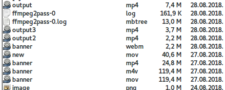

# WebVideo

This is a bash script, and HTML5 or javascript canvas based cross-browser mobile friendly video player.

Bash script utilzes ffmpeg, convert and optimizes video for usage on websites 


After some experimenting I have figured out that following code, including javascript canvas player works
on most devices.

Full code with nice centered video and overlay working on all devices is available in index.htm 

```
<video id="video1" poster="bg.jpg" class="video" muted="muted" loop="loop" autoplay="autoplay">
    <source src="bg.webm" type="video/webm">
    <source src="bg.mp4" type="video/mp4">
  Your browser does not support HTML5 video.
</video>
```
## WEBM

After playing a while... I was able to reduce 120 MB mov file to 2.2 MB file wihilst retaining the very good quality
with following command...
```
ffmpeg -i banner.mov -vcodec libvpx -r 24 -an -movflags faststart  -c:v libvpx-vp9 -crf 30 -b:v 750k banner6.webm
```
Checkout the top file on this list.


The 1.1 MB file is done with default encoding without -b:v flag. I think with vp8, but it's quality is not satisfying...

* OSX users, you might want to reinstall ffmpeg with libvpx, I did it using homebew reinstall like this:

`brew reinstall ffmpeg --with-libvpx`

## MP4

Also, after playing for a while, turned out this command gave me the best results.
It is a two pass command:

```
ffmpeg -y -i banner.mov -c:v libx264 -b:v 1300k -pass 1 -an -f mp4 /dev/null && ffmpeg -i banner.mov -c:v libx264 -b:v 1300k -pass 2 -profile:v main -level 4.0 -movflags +faststart output3.mp4
```
Ending result is file output3.mp4 3.7 MB file, but with very fine quality.



