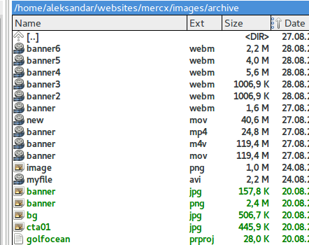

# webvideo
Bash script to utilze ffmpeg, convert and optimize video for usage on websites 


After playing a while... I was able to reduce 120 MB mov file to 2.2 MB file wihilst retaining the very good quality
with following command...
```
ffmpeg -i banner.mov -vcodec libvpx -r 24 -an -movflags faststart  -c:v libvpx-vp9 -crf 30 -b:v 750k banner6.webm
```
Checkout the top file on this list.



The 1.1 MB file is done with default encoding without -b:v flag. I think with vp8, but it's quality is not satisfying...
